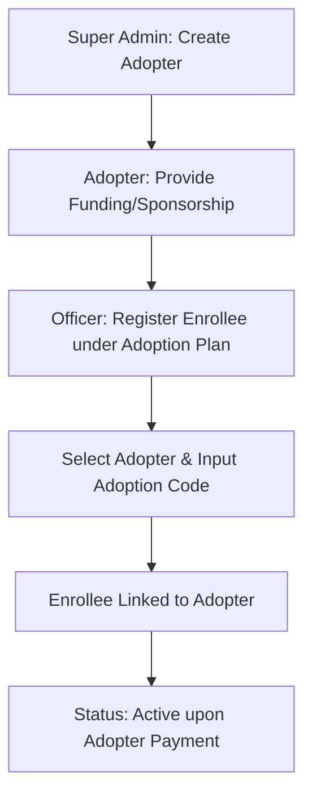

# Enrollee Adoption Workflow

The Adoption model is a philanthropic feature of the Ashia Portal that allows individuals or organizations ("Adopters") to sponsor the health insurance premiums for vulnerable or selected enrollees.

## 1. Process Overview

The adoption process bridges the gap between donors and beneficiaries, ensuring that sponsored enrollees can access care without personal financial burden.

---

## 2. Detailed Steps

### Phase 1: Adopter Management
- **Actor**: Super Admin.
- **Action**: Creating the Adopter profile (Name, Organization type).
- **Purpose**: Establishes a formal entity in the system that can be credited with payments.

### Phase 2: Enrollee Registration (Adoption Plan)
- **Actor**: Registration Officer.
- **Workflow**: 
    1. During registration, the officer selects the **Informal Adoption** plan.
    2. In the "Institution Details" step, they must select an **Adopter** from the list of approved donors.
    3. They enter a unique **Adoption Code** (often provided by the Adopter or generated for a specific sponsorship drive).
- **Identification**: This links the enrollee to the Adopter for all future billing and reporting.

### Phase 3: Premium Fulfillment
- **Financials**: Instead of the individual enrollee paying N12,000, the bill is routed to the Adopter's account or paid in bulk by the Adopter.
- **Activation**: Once the Adopter's commitment is financially reconciled, all enrollees linked to them are activated.

---

## 3. Reporting & Accountability
Adopters have access (or reports are generated for them) to see the impact of their sponsorship:
- **Enrollee List**: A view of all individuals currently covered under their adoption.
- **Utilization**: (In advanced modules) Reports on how many services their adoptees have accessed.

---
*Documentation Version: 1.0 (2026-03-26)*
