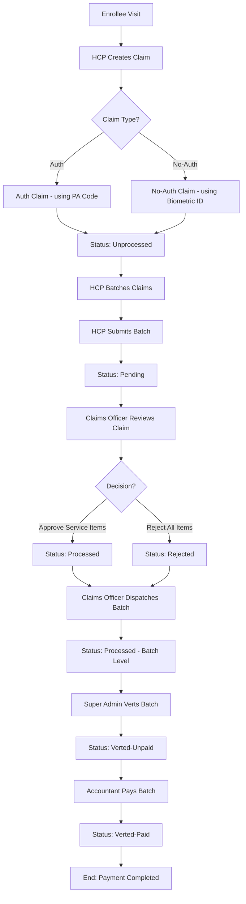

# Claims Processing Process Documentation

This document outlines the end-to-end lifecycle of a medical claim within the Ashia Portal system, from the initial encounter with an enrollee to the final payment by the finance department.

## Process Overview

The claims process involves five primary actors and follows a structured batch-based workflow to ensure transparency, accountability, and accuracy in medical billing.

### 1. The Actors
- **Enrollee**: The beneficiary receiving healthcare services.
- **Health Care Provider (HCP)**: The facility providing services and initiating the claim.
- **Claims Officer (Claims Processor)**: The internal staff member who reviews and validates individual claim items.
- **Super Admin**: The high-level authority who verifies (verts) processed claims for payment.
- **Accountant (Finance)**: The officer responsible for executing payments to the HCPs.

---

## The Workflow Lifecycle

---

## Detailed Step-by-Step

### Phase 1: Claim Initiation (HCP)
1.  **Encounter**: An Enrollee visits an HCP for medical services.
2.  **Claim Creation**: The HCP staff records the encounter.
    -   **Auth Claims**: Requires a Pre-Authorization (PA) code obtained previously.
    -   **No-Auth Claims**: Uses the Enrollee's Biometric ID for verification.
3.  **Service Entry**: The HCP adds diagnosis and service items (medications, procedures, etc.) to the claim.
4.  **Initial Status**: The claim is created with the `unprocessed` status.

### Phase 2: Batching & Submission (HCP)
1.  **Grouping**: The HCP groups multiple `unprocessed` claims into a **Batch** (typically monthly).
2.  **Submission**: The HCP submits the batch to the portal.
3.  **Status Transition**: All claims in the submitted batch move to the `pending` status.

### Phase 3: Review & Processing (Claims Officer)
1.  **Review**: The Claims Officer accesses the `pending` claims.
2.  **Itemized Approval**: Each service item within a claim is reviewed. The officer can approve or adjust the amount or reject the item entirely with a comment.
3.  **Claim Decision**: 
    -   If at least one item is approved, the claim status becomes `processed`.
    -   If all items are rejected, the claim status becomes `rejected`.
4.  **Dispatch**: Once the officer finishes reviewing all claims in a batch, they **Dispatch** the batch.
5.  **Finalizing Review**: Upon dispatch, claims marked as `processed` transition to `verified`. Any claims left as `pending` (unreviewed) are automatically `rejected`. The batch status moves to `processed`.

### Phase 4: Verting & Verification (Super Admin)
1.  **Batch Verting**: The Super Admin reviews the `processed` batch and "verts" it.
2.  **Financial Calculation**: The system calculates the `total_amount` to be paid based on the amounts approved by the Claims Officer.
3.  **Status Transition**: The batch status moves to `verted-unpaid`.

### Phase 5: Payment (Accountant / Finance)
1.  **Payment Processing**: The Accountant views `verted-unpaid` batches.
2.  **Execution**: After confirming payment (e.g., via Remita or bank transfer), the Accountant marks the batch as **Paid**.
3.  **Completion**: 
    -   Batch status moves to `verted-paid`.
    -   All `verified` claims within the batch are updated to `payment_status = paid`.

---

## Key Status Reference

| Entity | Status | Description |
| :--- | :--- | :--- |
| **Claim** | **unprocessed** | Created by HCP, not yet submitted. |
| **Claim** | **pending** | Submitted in a batch, awaiting officer review. |
| **Claim** | **processed** | Reviewed by officer with approved items. |
| **Claim** | **verified** | Batch dispatched, ready for verting. |
| **Claim** | **rejected** | Declined during review or left pending at dispatch. |
| **Batch** | **submitted** | Received from HCP, awaiting processing. |
| **Batch** | **processed** | Dispatched by officer. |
| **Batch** | **verted-unpaid** | Approved by Super Admin, awaiting finance. |
| **Batch** | **verted-paid** | Payment finalized by Accountant. |

---

## Addendum: PA Code Request & Generation

The Pre-Authorization (PA) code is a prerequisite for "Auth" type claims. It ensures that certain medical services or high-cost procedures are reviewed and approved before they are administered.

### 1. Request Initiation (HCP)
1.  **Eligibility Check**: The HCP identifies an Enrollee who needs a service requiring pre-authorization.
2.  **Request Submission**: The HCP submits a PA Request containing:
    -   The Enrollee or Dependant ID.
    -   The requested medical services and diagnoses.
    -   The request type (Routine or Urgent).
3.  **Initial Status**: The request is created with a `pending` status.

### 2. Review and Locking (Account Management)
1.  **Locking Mechanism**: When an Account Management Officer opens a `pending` request, the system applies an **atomic lock** (`current_viewer`). This prevents other officers from reviewing the same request simultaneously.
2.  **Clinical Review**: The officer reviews the requested items. They can approve the full quantity, a partial quantity, or reject specific items with a comment.
3.  **Decision**:
    -   **Approved**: If at least one service item is approved.
    -   **Rejected**: If all items are denied.

### 3. PA Code Generation
If the request is approved, the system automatically generates a unique PA code using the following logic:
-   **Format**: `PA-YYYY-MM-DDXXXX` (e.g., `PA-2024-03-260501`).
-   **Prefix**: `PA-` followed by the current date.
-   **Sequence**:
    -   The system looks for the last generated code for that day.
    -   If found, it increments the last 4 digits by 1.
    -   If it's the first request of the day, it starts the sequence based on the day of the month (e.g., for the 26th day, it starts at `2601`).
-   **Concurrency**: The generation happens within a database transaction with a `lockForUpdate` to ensure no two requests ever receive the same code.

### 4. Code Usage
Once the status transitions to `approved` and the code is generated, the HCP can view the code and use it to file an **Auth Claim** as part of the standard claims processing workflow.
