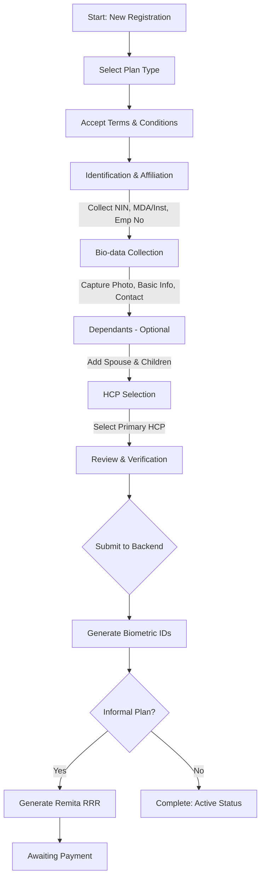

# Enrollee Registration Process Documentation

This document describes the end-to-end process for registering a new enrollee into the Ashia Portal system. The registration is performed by a **Registration Officer** and involves a multi-step workflow.

## 1. Process Overview

The registration process is designed to collect comprehensive data about the principal enrollee and their dependants, verify their identity via NIN, and assign them to a Health Care Provider (HCP).

---

## 2. Detailed Registration Steps

### Step 1: Plan Selection
The officer selects the appropriate insurance plan for the enrollee.
- **Formal Sector**: Public Sector (State/LGA employees).
- **Informal Sector**: Private Sector, Adoption, TISHIP (Students), or Vulnerable Groups (BHCPF).

### Step 2: Agreement
The enrollee/officer must accept the **Pre-registration Agreement**, which outlines the premium costs, waiting periods, and service limits.

### Step 3: Identification & Affiliation
This phase links the enrollee to their professional or social group:
- **NIN**: A valid 11-digit National Identification Number is mandatory.
- **MDA / Institution**: Selecting the Ministry, Department, Agency, or School the enrollee belongs to.
- **Employment Number**: 
    - For **Formal Public Sector**, this is the staff's payroll/employment number.
    - For **Informal Private/BHCPF**, the system auto-generates a unique sequence number.
- **Adoption**: For the Adoption plan, a specific **Adopter ID** and **Adoption Code** are required.

### Step 4: Bio-data & Biometrics
The core personal information is collected here:
- **Personal Info**: Full name, Sex, Date of Birth, Marital Status, Religion.
- **Health Info**: Blood Group, Genotype, and pre-existing conditions (Diabetes, Hypertension, etc.).
- **Contact Info**: Phone, Email, Residential Address (LGA and Town).
- **Photo Capture**: A real-time photo is captured using the system's webcam interface and uploaded to S3. This photo is used for the ASHIA ID card.
- **Next of Kin**: Name, Address, Phone, and Relationship.

### Step 5: Dependants (Spouse & Children)
The system allows adding dependants to the principal’s account:
- **Spouse**: One spouse can be registered with their name, DOB, and photo.
- **Children**: Up to four children (or more depending on plan rules) can be added. Each child requires a name, sex, DOB, NIN, and photo.

### Step 6: HCP Selection
The enrollee chooses their **Preferred Primary Health Care Provider (HCP)**. The list of available HCPs is typically filtered by the enrollee's residential LGA to ensure proximity.

---

## 3. Backend Processing Logic

Upon submission, the `EnrolleeController@store` method executes the following:

1.  **Biometric ID Generation**:
    - Generates a unique `biometric_id` for the principal (e.g., based on plan prefix).
    - Generates sequential `biometric_id`s for the spouse and each child.
2.  **Status Assignment**:
    - **Formal Sector**: Set to `active` immediately. Issue/Expiry dates are calculated.
    - **Informal Sector**: Set to `incomplete` until payment is confirmed.
3.  **Remita Integration**:
    - For informal plans, the system contacts the Remita API to generate an **RRR (Remita Retrieval Reference)** for the annual premium (typically N12,000 per individual).
4.  **Role Assignment**: Assigns the [Enrollee](file:///Users/deji/Workspace/uverus/_uverustech/ashia-portal/app/%28registration-officer-dashboard%29/registration-officer-dashboard/registration-steps/institution-step/page.tsx#98-524) role to the record, enabling future login to the Enrollee Dashboard.

---

## 4. Key Data Reference

| Field | Type | Description |
| :--- | :--- | :--- |
| **Biometric ID** | Generated | Unique identifier for care access (ASHIA ID). |
| **NIN** | 11 Digits | Validated against format rules. |
| **Status** | active | Can access care. |
| **Status** | incomplete | Registered but awaiting payment or verification. |
| **Status** | suspended | Plan expired or manually disabled. |

---
*Documentation Version: 1.0 (2026-03-26)*
