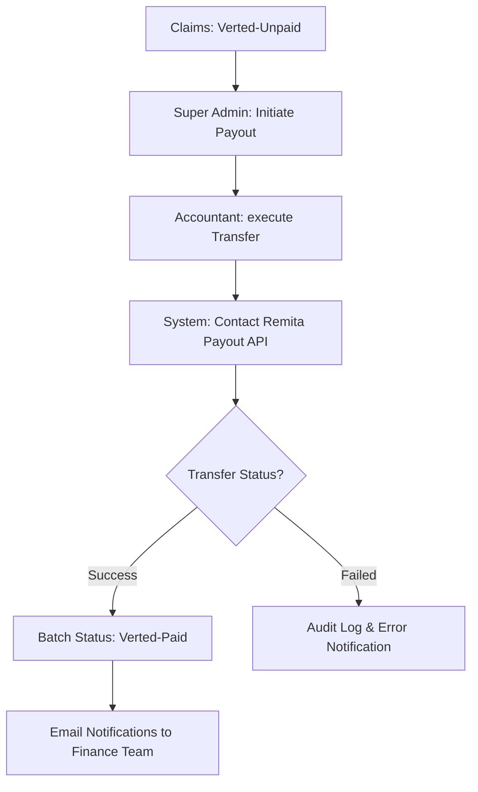

# Financial Reconciliations & Remita Integration

The Ashia Portal uses the **Remita** payment gateway for all financial transactions, including incoming premium payments from enrollees and outgoing payouts to Health Care Providers (HCPs).

## 1. Premium Payments (RRR)
For enrollees in the **Informal Sector**, health insurance is based on an annual premium (currently N12,000).

### The RRR Process
1.  **Generation**: During or after registration, the system generates a **Remita Retrieval Reference (RRR)** via the `RemitaService`.
2.  **Payment**: The enrollee uses this RRR to pay at any bank branch or online via ATM card/USSD.
3.  **Activation**: 
    - Upon successful payment confirmation, the system updates the Enrollee's status to **Active**.
    - For initial registrations, the `status` moves from `incomplete` to `active`.
    - For renewals, the `expiry_date` is extended by one year.

---

## 2. HCP Payouts (Outgoing)
The finance department uses the portal to pay HCPs for the medical claims they have processed.

### Payout Workflow

### Key Features
- **Bank List**: The system dynamically fetches the list of supported Nigerian banks via the Remita API.
- **Bulk Transfers**: Accountants can process multiple HCP payments in a single bulk transaction to save time and reduce manual entry errors.
- **Audit Tracking**: Every payout is recorded as a [Payout](file:///Users/deji/Workspace/uverus/_uverustech/ashia-portal-api/app/Http/Controllers/RemitaController.php#136-151) model in the database, linked to the `User` (Accountant) who executed it, with the full response payload from Remita.

---

## 3. Financial Roles & Permissions

| Role | Permission | Responsibility |
| :--- | :--- | :--- |
| **Enrollee** | N/A | Pays premium via RRR. |
| **Super Admin** | `GenerateRRR` | Can manually re-issue RRRs if needed. |
| **Accountant** | `ExecutePayout` | Performs bank transfers and reconciles bank statements. |

---
*Documentation Version: 1.0 (2026-03-26)*
