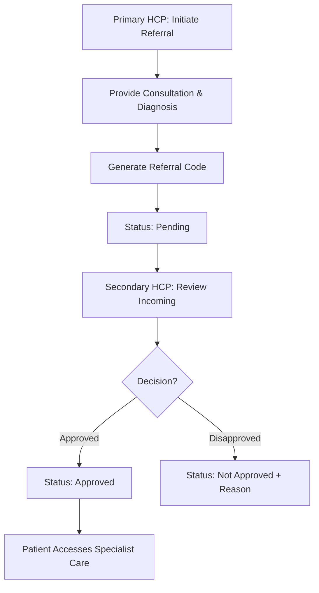

# Medical Referrals & Clinical Encounters

This document details two critical clinical workflows in the Ashia Portal: the **HCP Referral** process and the **Clinical Encounter** logging system.

## 1. Medical Referrals (HCP-to-HCP)

The referral system manages the transfer of an enrollee from a primary Health Care Provider (HCP) to a secondary or specialist facility.

### Process Workflow

### Key Details
- **Referral Code**: A unique 14-character alphanumeric code generated automatically: `ASHIA/REFYYYYMMDDXXXXXX`.
- **Authorization**: Only HCPs associated with the enrollee (Primary or Secondary) can view or manage their referrals.
- **Attachments**: HCPs can upload medical reports or test results as part of the referral.
- **Decision Logic**: A referral must be "Approved" by the receiving facility before they can bill for services rendered under that referral.

---

## 2. Clinical Encounters

A Clinical Encounter is the record of an enrollee's visit to an HCP. It serves as the clinical evidence for future claims.

### The Encounter Lifecycle
1.  **Patient Visit**: The enrollee presents at the HCP facility.
2.  **Clinical Entry**: The HCP staff records the encounter details in the portal:
    -   **Diagnosis**: Selected from the standardized system diagnosis list.
    -   **Management (MGT)**: A textual description of the treatment plan or services provided.
3.  **Authentication**: The enrollee must provide a **biometric/digital signature** at the point of care.
    -   *Technical Note*: This is stored as a base64 encoded string (`enrollee_signature`) in the database.
4.  **Verification**: For certain plans, the encounter is verified against the enrollee's preferred HCP settings to ensure they are at the correct facility.

### Data Model Reference

| Field | Type | Description |
| :--- | :--- | :--- |
| **Enrollee ID** | UUID | Link to the registered enrollee. |
| **Diagnosis** | Slug | Standardized diagnostic code. |
| **Management** | Text | Details of care provided. |
| **Enrollee Signature** | Base64 | Mandatory digital sign-off by the patient. |

---
*Documentation Version: 1.0 (2026-03-26)*
